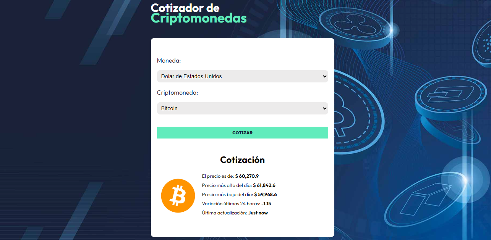

<h1 align="center">Cotizador de criptomonedas</h1>

     

<h2> :page_facing_up: Descripción del proyecto</h2>

 La aplicación consiste en la búsqueda de la cotización de una moneda en particular en cualquier criptomoneda, recogiendo
datos de una API

<b>Proyecto: <a href="https://monumental-taffy-293568.netlify.app" target="_blank">Cotizador</a></b>

<h2> :heavy_check_mark: Características</h2>

 Proyecto creado en React donde se utilizará una API (<a href="https://min-api.cryptocompare.com/documentation">Documentación</a>).
  Para realizar el type se utilizará ZOD, para los estilos se ha utilizado css y también 
  se incorporará un <a href="https://tobiasahlin.com/spinkit/">spinner de carga</a> para tener una buena retroalimentación.

<h2> :hammer: Tecnologías aplicadas</h2>

<ul>
  <li>React</li>
  <li>Vite</li>
  <li>TypeScript</li>
  <li>CSS</li>
  <li>JSX</li>
  <li>API</li>
  <li>ZOD</li>
</ul>

<h2>Idea del proyecto</h2>

Séptimo proyecto realizado durante el curso de <a href="https://www.udemy.com/course/react-de-principiante-a-experto-creando-mas-de-10-aplicaciones/?couponCode=KEEPLEARNING">React y TypeScript</a>

<a href="https://github.com/antii16/clima-react"> Ver proyecto anterior </a> 
